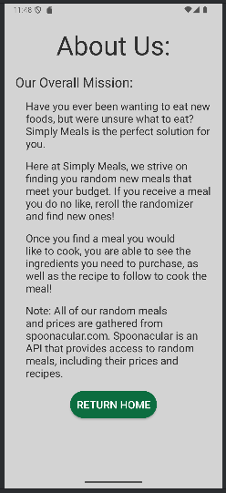
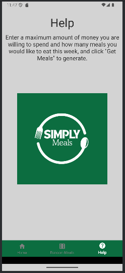

# Simply Meals
- The Simply Meals app can plan out random meals for you! It will present you the cost per portion, the ingredients, and the recipe of random meals.
- Users are able to enter a desired price range as well as the number of meals that they want to generate and the app will automatically show random dishes that fit the needs of the user.
- Keep in mind, if the price per meal is too low, the app may not show any meals. Also, the app may not show the desired number of meals if there are not enough meals under the price the user requested.  
- Simply Meals uses an API (the API is spoonacular) to get all the random meals, along with the meals price, ingredients, and recipe.
- When the meal has been generated, an image representing the meal will show along with the ingredients and the recipe for that meal so the user can choose which dish they want to make. The user can then click on the "Show Ingredients" and "Show Recipe" buttons to see the ingredients needed to prepare the meals as well as the steps that need to be taken to make them.
- There are a few ways to download and run the app:
- 1) To download and run the app on Android Studio, please navigate to the main branch. From here, please select the green "Code<>" button, and then choose 'Download ZIP.' You will then be able to unzip the file and open the app in Android Studio.
- 2) Another way to import the app to Android Studio is to copy the link from the main branch. The link is 'https://github.com/sethjameson/meal-planner-app.' With this link, please open Android Studio, select new project, get from version control, and use the link to clone the project to your desired directory. 
- Below are a few images showing the app running.

